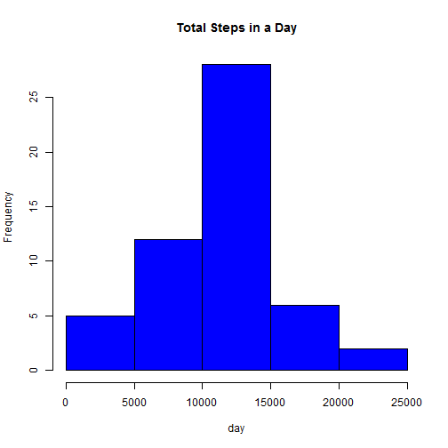
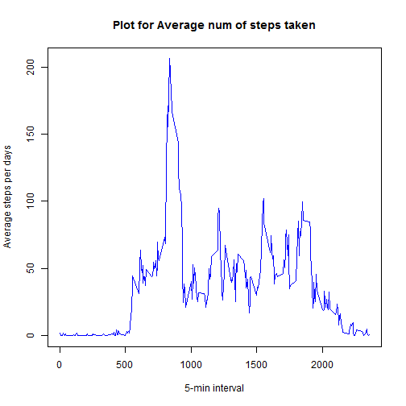
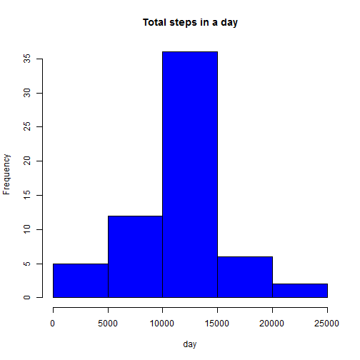
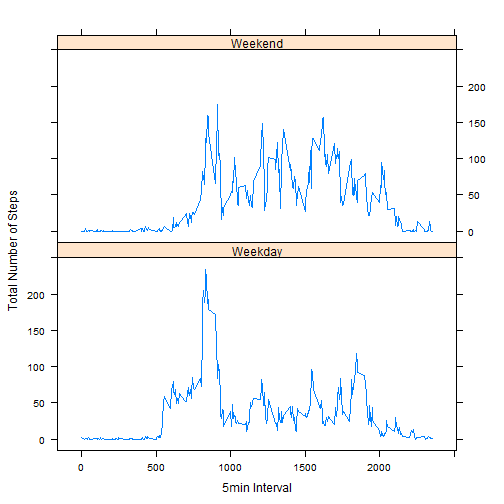

### Loading and preprocessing the data


```r
activity <- read.csv("activity.csv", colClasses = c("numeric", "character", 
    "numeric"))

head(activity)
```

```
##   steps       date interval
## 1    NA 2012-10-01        0
## 2    NA 2012-10-01        5
## 3    NA 2012-10-01       10
## 4    NA 2012-10-01       15
## 5    NA 2012-10-01       20
## 6    NA 2012-10-01       25
```

```r
## Names of various activities
names(activity)
```

```
## [1] "steps"    "date"     "interval"
```


```r
## Load the 'lattice library used for plotting.

library(lattice)

activity$date <- as.Date(activity$date, "%Y-%m-%d")
```

### What is mean total number of steps taken per day?


```r
## find the aggregate number of daily steps
## plot the histogram and then mean number of steps

TotalStepsAday <- aggregate(steps~date, data = activity, sum, na.rm=TRUE)
hist(TotalStepsAday$steps, main = "Total Steps in a Day",xlab="day", col="blue")
```

 

```r
## Calculate the mean and median of the steps taken

print (mean(TotalStepsAday$steps))
```

```
## [1] 10766.19
```

```r
print (median(TotalStepsAday$steps))
```

```
## [1] 10765
```


## What is the average daily activity pattern?


```r
## get the time series data for the steps with mean number
timeseries <- tapply(activity$steps, activity$interval, mean, na.rm=TRUE)

## plot the graph with 5min interval.
plot(row.names(timeseries), timeseries, type = "l", xlab = "5-min interval", 
    ylab = "Average steps per days", main = "Plot for Average num of steps taken", 
    col = "blue")
```

 

```r
## Find out the 5min internal which has max number steps taken.
max_5mininterval <- which.max(timeseries)
#print(names(timeseries))
print(max_5mininterval)
```

```
## 835 
## 104
```

## Imputing missing values


```r
## find out how many iterations  values are missing in the dataset
## i.e. total numbers of rows with NA in the dataset

activity_withNAs <- sum(is.na(activity))
print(activity_withNAs)
```

```
## [1] 2304
```

*Devise a strategy for filling in all of the missing values in the dataset. The strategy does not need to be sophisticated. For example, you could use the mean/median for that day, or the mean for that 5-minute interval,etc*


```r
StepsAverage <- aggregate(steps ~ interval, data = activity, FUN = mean)
fillNA <- numeric()
for (i in 1:nrow(activity)) {
    obs <- activity[i, ]
    if (is.na(obs$steps)) {
        steps <- subset(StepsAverage, interval == obs$interval)$steps
    } else {
        steps <- obs$steps
    }
    fillNA <- c(fillNA, steps)
}


## New dataset with NAs filled with a neumeric value

newActivity <- activity
newActivity$steps <- fillNA
```


*Make a histogram of the total number of steps taken each day and Calculate and report the mean and median total number of steps taken per day. Do these values differ from the estimates from the first part of the assignment? What is the impact of imputing missing data on the estimates of the total daily number of steps?*


```r
## draw the histogram using new dataset which has NAs filled with numeric value
TotalSteps <- aggregate(steps ~ date, data = newActivity, sum, na.rm = TRUE)

## Histogram is plotted
hist(TotalSteps$steps, main = "Total steps in a day", xlab = "day", col = "blue")
```

 


```r
## Calucate the mean and median as earlier for the new dataset with NAs filled.
mean(TotalSteps$steps)
```

```
## [1] 10766.19
```

```r
median(TotalSteps$steps)
```

```
## [1] 10766.19
```

## Are there differences in activity patterns between weekdays and weekends?

*For this part the weekdays() function may be of some help here. Use the dataset with the filled-in missing values for this part.*


```r
## In the dataset given first identify the weekdays and weekends

day <- weekdays(activity$date)
datelevel <- vector()

## run the loop for all the rows
for (i in 1:nrow(activity)) {
        if (day[i] == "Saturday") {
                datelevel[i] = "Weekend"
        } else if (day[i] == "Sunday") {
                datelevel[i] = "Weekend"
        } else {
                datelevel[i] = "Weekday"
        }
}

#replace the daylevel field the dataset with either Weekend or Weekday appropriately
activity$daylevel <- datelevel
activity$daylevel <- factor(activity$daylevel)

stepsByDay <- aggregate(steps~interval + datelevel, data = activity, mean)
names(stepsByDay) <- c("interval", "daylevel", "steps")
```

*Make a panel plot containing a time series plot (i.e. type = "l") of the 5-minute interval (x-axis) and the average number of steps taken, averaged across all weekday days or weekend days (y-axis).*

The plot should look something like the following, which was creating using simulated data:


```r
## Plot the grpgh showing, numbers steps taken during weekday and weekend
xyplot(steps ~ interval | daylevel, stepsByDay, type = "l", layout = c(1, 2), 
    xlab = "5min Interval", ylab = "Total Number of Steps")
```

 

